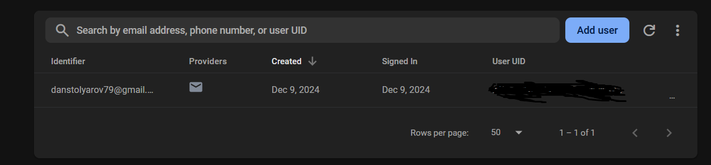
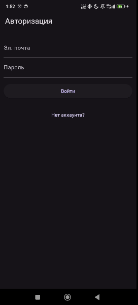
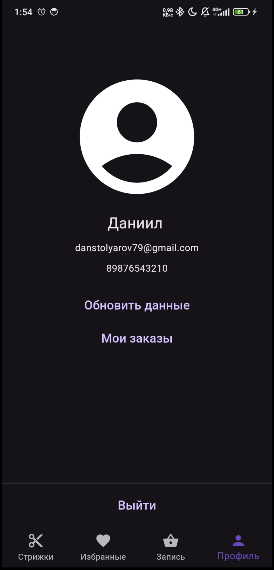

## Задание
Добавить чат с продавцом на страницу Профиль.

### Шаг 1. Доработка API
Теперь пользователи хранятся в Firebase. В таблицы БД (Корзина, Избранное) добавлено поле UID, которое является уникальным токеном клиента.

С учётом UID обновлены следующие запросы:
* POST /favourite - теперь требует firebase UID
* GET /favourite - теперь требует firebase UID
* DELETE /favourite - теперь требует firebase UID
* GET /cart - теперь требует firebase UID
* POST /cart - теперь требует firebase UID
* PUT /cart - теперь требует firebase UID
* DELETE /cart - теперь требует firebase UID
* GET /orders - теперь требует firebase UID
* POST /order - теперь требует firebase UID

Весь API описан в файле <a href="./backend/backend.go">backend.go</a> и протестирован с помощью <a href="https://elements.getpostman.com/redirect?entityId=24015280-8a099f19-cf00-4125-9654-e3b574800df0&entityType=collection">Postman</a>

### Шаг 2. Доработка интерфейса

Исходя из предыдущего шага понятно, что никаких действий кроме просмотра стрижек неавторизованный пользователь выполнить не может.

Поэтому неавторизованному пользователю будет видна только страница авторизации.

* 
 Состояние: Неавторизован

* 
 Состояние: Авторизован

### Шаг 3. 