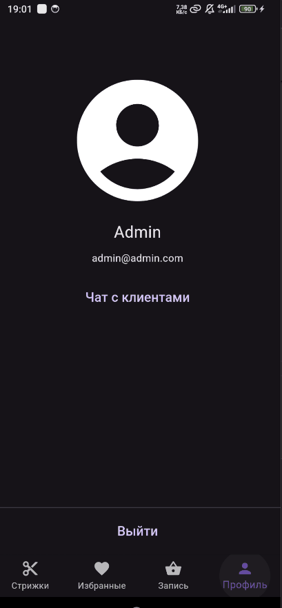

# Практика 14-15 Столяров ЭФБО-01-22 22T0318

## Задание
Добавить чат с продавцом на страницу Профиль.

### Шаг 1. Доработка API
Теперь пользователи хранятся в Firebase. В таблицы БД (Корзина, Избранное) добавлено поле UID, которое является уникальным токеном клиента.

С учётом UID обновлены следующие запросы:
* POST /favourite - теперь требует firebase UID
* GET /favourite - теперь требует firebase UID
* DELETE /favourite - теперь требует firebase UID
* GET /cart - теперь требует firebase UID
* POST /cart - теперь требует firebase UID
* PUT /cart - теперь требует firebase UID
* DELETE /cart - теперь требует firebase UID
* GET /orders - теперь требует firebase UID
* POST /order - теперь требует firebase UID

Весь API описан в файле <a href="./backend/backend.go">backend.go</a> и протестирован с помощью <a href="https://elements.getpostman.com/redirect?entityId=24015280-8a099f19-cf00-4125-9654-e3b574800df0&entityType=collection">Postman</a>

### Шаг 2. Доработка интерфейса

Исходя из предыдущего шага понятно, что никаких действий кроме просмотра стрижек неавторизованный пользователь выполнить не может.

Поэтому неавторизованному пользователю будет видна только страница авторизации.

* 
 Состояние: Неавторизован

* 
 Состояние: Авторизован

### Шаг 3.

Подключим Firestore Database.

Установим библиотеки: для работы с firestore и для отображения сообщений в пузырях.
<pre>
  flutter pub add cloud_firestore
  flutter pub add flutter_chat_bubble 
</pre>

### Шаг 4. 

Пользователи не могут общаться с другими пользователями (только с продавцом), поэтому в сообщении нужно хранить только id покупателя. Дополнительная переменная будет отвечать за то, отправлено ли оно от Администратора.

Добавим структуру данных - элемент списка чатов:

<pre> 
@JsonSerializable()
class ChatUser {
  ChatUser(this.email, this.uid, this.name, this.lastMessageContent);
  String email;
  String uid;
  String name;
  String lastMessageContent = "";
  factory ChatUser.fromJson(Map<String, dynamic> json) =>
      _$ChatUserFromJson(json);
  Map<String, dynamic> toJson() => _$ChatUserToJson(this);
}
</pre>

И ещё одну структуру - для хранения данных сообщения

<pre> 
@JsonSerializable()
class Message {
  Message(this.customerUID, this.isFromAdmin, this.content, this.timestamp);
  String customerUID;
  bool isFromAdmin;
  String content;
  DateTime timestamp;
  factory Message.fromJson(Map<String, dynamic> json) =>
      _$MessageFromJson(json);
  Map<String, dynamic> toJson() => _$MessageToJson(this);
}
</pre>

Администратор - это единственный пользователь с почтой admin@admin.com

На странице Профиль у обычного пользователя есть кнопка "Чат с продавцом", которая открывает страницу с чатом. У администратора в этом же месте другая кнопка - "Чат с клиентами", которая открывает список чатов, в котором уже затем можно выбрать конкретного пользователя и ответить ему.

### Шаг 5. Тестирование
Очистим firestore и создадим 3-х пользователей:
- admin@admin.com
- danya@gmail.com
- egor@gmail.com

Войдём за admin@admin.com и увидим, что список чатов пуст.

Войдём за danya@gmail.com и egor@gmail.com, отправим пару сообщений:

Вот что увидит admin@gmail.com:

## Предпоказ .GIF

## upd:
Добавлена иконка приложения

